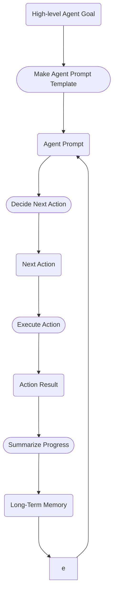
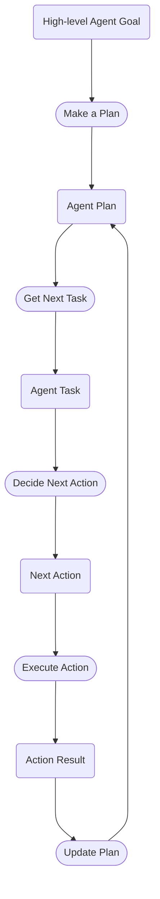

One of the key problems of building [agentic](https://en.wiktionary.org/wiki/agentic#:~:text=That%20behaves%20like%20an%20agent,on%20the%20behalf%20of%20another.) AI systems is enabling the agents to build and utilize databases of knowledge.


## Three Examples

1. **WildfireMgmtGPT**

WildfireMgmtGPT's overall goal is to put together a comprehensive [wildfire](https://en.wikipedia.org/wiki/Wildfire) management plan for the United States. This plan will cover high-level national and state strategies for national parks management, building regulations, and emergency response and also include city- and county- level recommendations for fire prevention and mitigation.  The agent has already searched and downloaded all public datasets on wildfires, all research papers on wildfire management, suppression, and prevention, and all local, state, and national regulations on public land use.  

_Next task:_ Make a specific policy recommendation for the civil engineers in [Dammeron Valley, UT](https://www.nytimes.com/interactive/2022/05/16/climate/wildfire-risk-map-properties.html), a town in one of the fastest growing regions of the United States, and one which every home in the town will be facing a 5% annual risk of burning down by 2052.

2. **ChiliExtractionOverseer**

ChiliExtractionOverseer (CEO for short) is an multi-purpose business development agent helping to grow a new direct-to-consumer hot sauce business.  The company is in its second quarter and has secured manufacturing capacity for a large run of new hot sauces.  The agent has access to a large database of prior consumers from the company's first round of distribution.  The company's initial run was enormously successful and was written up in food journals and featured in the recipes section of several major news outlets.  

_Next task:_ Write targeted ad copy for each of 30 audience segments that it has identified.

3. **PersonalAssistantGPT**

PersonalAssistantGPT is your secret weapon for managing your complex work and life schedule.  It helps manage your social calendar so you don't forget important birthdays and anniversaries, keeps track of all your subscriptions and doctor's appointments, keeps an eye out for concert announcements from your favorite artists and sales from your favorite brands.  It's also helping you plan your upcoming wedding!  It has compiled a database of venues and vendors based on your and your partner's preferences and another database of food allergies and preferences by scraping publicly available information from your social graph.  

_Next task:_ Work out the recipes and grocery lists for your reception dinner.

## Problem solving with context

The essential fact here is that to make an effective AI agent, the agent must be able to _gather_ information relevant to its goals, _store_ that information in some combination of files, indices, and databases, and then _retrieve_ selections of the information is has collected to provide context in selecting appropriate actions to solve tasks to help achieve its goals.  At its core the agent paradigm is about providing a parameterized prompting framework for a language model and expecting it to intelligently fill in those parameters. b

## A task

The prompt for an agent task will look something like:

_System Prompt_

```
You are WildfireMgmtGPT, an agent tasked with putting together a wildfire management 
plan for the United States.  Your specific goals are:
{LIST OF GOALS}

So far you have:
{SUMMARY OF PROGRESS SO FAR}

The current date and time is July 17, 2023, 18:58.

```

_User Prompt_

```
Your next task is 
{TASK DESCRIPTION}. 

You have gathered the following information relevant to this task:
{TASK RELEVANT CONTEXT}.

To accomplish the task you can use any of the following abilities: 
{LIST OF AGENT ABILITIES}.

What would you like to do next?
```
where {ALL CAPS} represents parameters the agent needs to fill in.  Some of these are relatively simple.  E.g. the {AGENT GOALS} come directly from a language model response to the initial user goal for the agent system; the {TASK DESCRIPTION} comes from a language model response in which the model is asked to break down goals into small, focused tasks and put them in priority order on a queue; the {LIST OF AGENT ABILITIES} comes directly from the agent framework and plugins.  

The problem comes to figuring out what goes in {TASK RELEVANT CONTEXT}.

## Paradigm 1: Just-in-time context 

Consider the following agent loop:




## Paradigm 2: Plan ahead context

The idea here is that, given a general goal, an Agent can do task breakdown in a way that links multiple tasks together in an intelligent way.  Then, when performing background research tasks that gather information, the agent can attach relevant pieces of information to linked tasks its doing the research for. This mirrors what a human might do in a similar situation to accomplish a complex goal.  

Consider the following agent loop:




We need something Ah

## Stuff we need to be able to do at a low level

**1. Document Preprocessing and Indexing**: Documents need to be preprocessed, which would involve steps like tokenization, lemmatization, removal of stop words, and then indexing.

**2. Named Entity Recognition (NER)**: We need NER models to identify entities such as geographical locations, organizations, infrastructure, and legal terminologies from the text. This step will help agents focus on specific entities relevant to a task.

**3. Topic Modeling**: Use topic modeling techniques like Latent Dirichlet Allocation (LDA) to classify documents based on their topics. This can assist in narrowing down the search when you are querying documents related to a particular topic, such as "coastal flooding".

4. Semantic Search: Using the indexed documents, semantic search can be performed using models like BERT or its successors. Semantic search will allow the system to understand the context behind a query and return documents that are semantically related to the query, even if they don't contain the exact query terms.

5. Text Summarization: Given that the AI agent has a limited context window, text summarization is critical. You can use extractive summarization methods to pull key sentences from the document or use abstractive summarization methods to generate a condensed summary. This will help provide the most relevant information in a digestible format.

6. Information Fusion: Information fusion combines information from various sources to increase the reliability and accuracy of the data. After retrieving and summarizing the documents, the system can fuse the information to provide a more comprehensive context.

7. Contextual Understanding: Your system should be capable of contextual understanding to focus on the most important information relevant to the specific task. If it's about making policy recommendations for a coastal village, the context should include geographical considerations, climate factors, local infrastructure, and legal constraints.

8. Question Answering: Incorporating a question-answering component can help your agent actively seek information. For example, if the AI needs details on a specific aspect of a law or a specific finding from a research paper, a question-answering component can return precise answers to these queries.